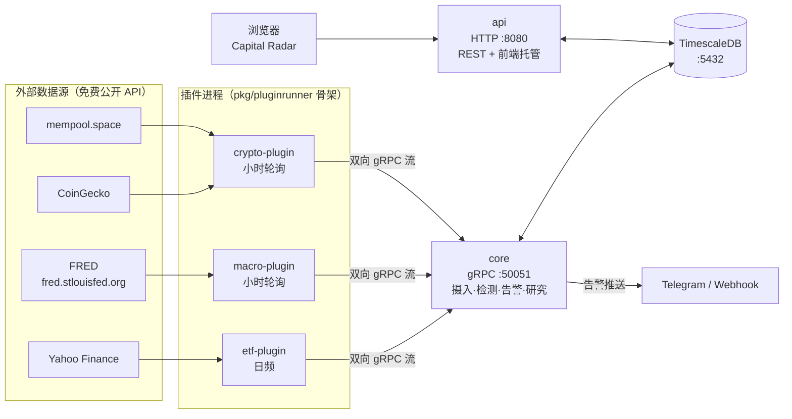
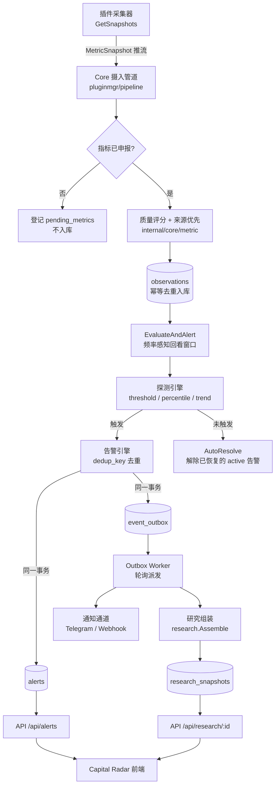
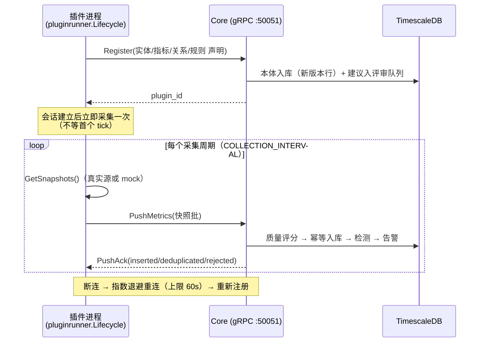
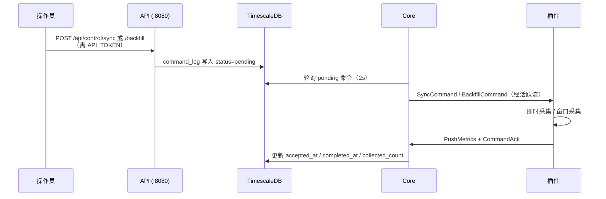

# Sonde — 系统架构运行图（中文）

> 本文描绘**实际建成**的系统（as-built），随代码演进更新；冻结版设计基线见
> [system-architecture.md](./system-architecture.md)（v1.1，仅存档不再修改）。

## 一、系统鸟瞰（部署视角）

五个容器 + 一个数据库，全部由 `deployments/docker-compose.yml` 编排：

要点：

- **插件与 Core 之间只有一条双向 gRPC 流**（ADR-6 单写者循环），注册、推数、命令、回执全部复用这条流。
- **API 与 Core 不直接通信**，二者只通过数据库解耦：API 写 `command_log`，Core 轮询取走；Core 写 `alerts` / `research_snapshots`，API 读取展示。

## 二、端到端数据流（一条观测的旅程）

关键约定（多轮检查沉淀的硬规则，详见 `.trellis/spec/backend/quality-guidelines.md`）：

- 观测查询带 LIMIT 时必须 **DESC 取数 + 内存反转**，保证最新行不被截掉。
- 研究组装取观测一律用**触发证据里的 `metric_uid`**，不用 `alert.MetricID`。
- 回看窗口按声明频率 × max(consecutive+1, min_observations) × 1.5 推算，钳制在 [7天, 365天]。
- 有真实实时源的指标，**禁止用 mock 造历史回填**（探测器不按 provider 过滤）。

## 三、插件会话生命周期

## 四、控制命令通路（Sync / Backfill）

## 五、数据表职责清单

| 表 | 职责 | 关键机制 |
|----|------|---------|
| `plugins` | 插件注册与健康 | 心跳 + 连续失败计数 |
| `entities` | 实体（观测对象） | 行级版本：(id, version) 主键 |
| `metric_definitions` | 指标定义 | 三段式 ID；`uid` 供 observations 关联 |
| `relation_suggestions` / `rule_suggestions` | 申报评审队列 | 插件只能建议，Core 裁决（ADR-2） |
| `relations` / `rules` | 关系/规则权威表 | 行级版本；调参产生新版本行 |
| `observations` | 观测时序（超表） | 幂等唯一索引；质量分三件套 |
| `pending_metrics` | 未申报指标登记 | 未声明先推送 → 挂起不入库 |
| `source_preferences` | 多来源优先级 | 同指标多源取舍 |
| `alerts` | 告警 | active 态 dedup_key 部分唯一索引 |
| `research_snapshots` | 研究快照 | 与告警 1:1，本体冻结时间可复现 |
| `event_outbox` | 事件出箱 | 与业务同事务写入，worker 异步派发 |
| `command_log` | 控制命令 | API 与 Core 之间的解耦信道 |

> 全部表与字段的中文注释已随迁移 `002_chinese_comments` 写入数据库，
> `psql \d+ <表名>` 可直接查看。

## 六、代码地图

| 目录 | 职责 |
|------|------|
| `cmd/core` | Core 进程装配与启动 |
| `cmd/api` | API 进程：REST + 前端托管 + 鉴权/限流中间件 |
| `internal/core/pluginmgr` | gRPC 会话、摄入管道、命令派发 |
| `internal/core/metric` | 质量评分、来源优先、pending 登记 |
| `internal/core/detector` | threshold / percentile / trend 三探测器 |
| `internal/core/alert` | 告警生命周期 + outbox worker |
| `internal/core/research` | 研究上下文组装 |
| `internal/core/notifier` | Telegram / Webhook 通知通道 |
| `internal/core/noise` | 噪音预算（≤10 条/天）跟踪 |
| `internal/core/ontology` | 本体持久化与版本管理 |
| `internal/core/relationmgr` / `rulemgr` | 关系/规则评审 |
| `internal/core/store` | PostgreSQL 持久化实现 |
| `pkg/pluginrunner` | 插件通用骨架（会话/重连/采集循环） |
| `pkg/model` | 共享领域类型 |
| `plugins/{etf,macro,crypto}` | 三个采集插件（独立 go module） |
